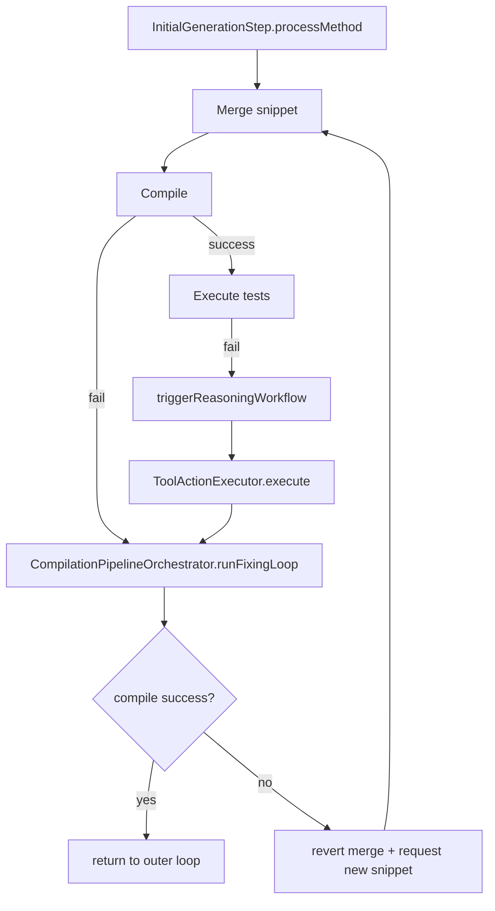
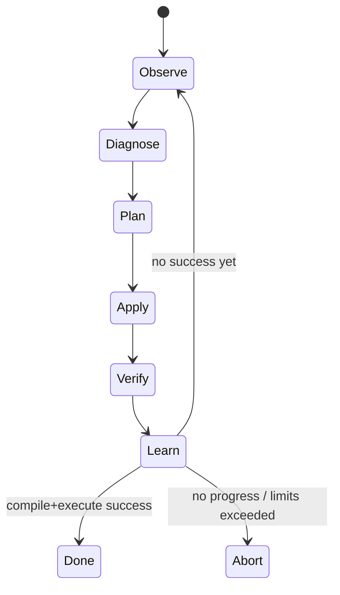

# Reasoning Flow: AS-IS и план переработки (TO-BE)

## 1. Цель документа

Этот документ фиксирует:

1. Как в текущем коде работает reasoning-цикл исправления тестов после compile/execute ошибок.
2. Почему цикл часто не сходится и дает "случайные" решения.
3. Как целевым образом переработать архитектуру, чтобы поведение стало детерминированным и воспроизводимым.
4. Поэтапный план миграции с критериями готовности.

Документ ориентирован на то, чтобы по нему можно было:

1. Восстановить текущий runtime flow по классам и методам.
2. Внести изменения без повторного "изобретения" pipeline.
3. Провести код-ревью изменений по четким инвариантам.

---

## 2. Границы и термины

- **Outer loop**: цикл в `InitialGenerationStep.processMethod` (до 5 попыток генерации/починки сниппета).
- **Inner loop**: цикл в `CompilationPipelineOrchestrator.runFixingLoop` (до 10 reasoning-итераций).
- **Reasoning response**: JSON-решение LLM (`decision + actions + memory_updates`).
- **Tool action**: атомарное действие исполнителя (`ToolActionExecutor`) для контекста или модификации кода.
- **Progress**: уменьшение количества/тяжести compile/execute ошибок после применения действия.

---

## 3. AS-IS: как работает сейчас

### 3.1 Компоновка зависимостей

Инициализация reasoning-компонентов делается в `TestPipeline.createGenerationStep`:

- `CompilationReasoningPromptBuilder`
- `ReasoningResponseParser`
- `CompilationReasoningService`
- `CompilationReasoningOrchestrator`
- `ReasoningWorkflow`

После этого `ReasoningWorkflow` передается в `InitialGenerationStep`.

### 3.2 Внешний цикл (outer loop)

Точка входа в reasoning на compile-ошибке:

- В `InitialGenerationStep.processMethod` выполняется merge сниппета в тестовый класс.
- Идет compile через `CompilerInvoker`.
- При неуспехе вызывается `fixingOrchestrator.runFixingLoop()`.
- Если inner loop не исправил ошибку, merge откатывается, строится `repairContext`, запрашивается новый сниппет у LLM, и outer loop идет на следующую попытку.

Точка входа в reasoning на execute-ошибке:

- После compile success запускается execute.
- При execute failure вызывается `triggerReasoningWorkflow(...)`, затем возвращенный action применяется через `ToolActionExecutor`, и снова запускается `runFixingLoop()` для compile-части.

Важно: в текущем исполнении compile/execute ветки объединены не в единую сессию, а в несколько разрозненных вызовов reasoning.

### 3.3 Внутренний цикл (inner loop)

`CompilationPipelineOrchestrator.runFixingLoop()` работает так:

1. Безкешевый compile (`compileWithoutCache`).
2. Если compile success -> завершение.
3. Если compile fail:
   - строится `CompilationErrorInfo`;
   - делается классификация `CompilationErrorClassifier`;
   - обновляется `ReasoningMemory` (`attempt`, `recentErrorSignatures`, `knownMissingSymbols`);
   - собирается `ReasoningLoopContext` (`error + project context + cumulative action result + memory`);
   - вызывается `ReasoningWorkflow.process(...)`.
4. Ответ LLM интерпретируется по `decision`:
   - `REQUEST_CONTEXT`: выполнить tool actions, добавить результат в cumulative execution log, уменьшить budget.
   - `APPLY_FIX`: выполнить actions, добавить в cumulative log, при наличии модификаций сбросить context budget.
   - `MARK_FALSE_DEPENDENCY`: только обновить memory.
   - иначе -> `FixingFailureException`.

Лимиты:

- `MAX_ITERATIONS = 10` для inner loop.
- `DEFAULT_CONTEXT_BUDGET = 3` в `ReasoningMemory`.

### 3.4 Prompt и parser

#### Prompt

`CompilationReasoningPromptBuilder` формирует prompt из:

- состояния memory (`state`, `attempt`, `budget`, `recent errors`, `context cache keys`);
- `CompilationErrorInfo`;
- `CompilationErrorReport`;
- `ProjectContextSummary`;
- cumulative execution result (если есть).

LLM обязан вернуть JSON:

```json
{
  "decision": "REQUEST_CONTEXT | APPLY_FIX | MARK_FALSE_DEPENDENCY | STOP",
  "actions": [
    { "type": "...", "args": { ... } }
  ],
  "memory_updates": {
    "knownMissingSymbols": [],
    "appliedFixSignatures": [],
    "contextCache": {"k":"v"}
  }
}
```

#### Parser

`ReasoningResponseParser`:

1. Пытается очистить fenced code block.
2. Парсит JSON в `ReasoningResponse`.
3. Нормализует `decision` (`upper + '_'`).
4. Валидирует allowed decisions и наличие actions для `REQUEST_CONTEXT/APPLY_FIX`.
5. При любой ошибке отдает fallback `STOP`.

### 3.5 Модель ответа LLM и маппинг действий

`ReasoningResponse.toToolAction()`:

- Нормализует `action.type` (например, `add_import` -> `ADD_IMPORT`).
- Маппит legacy-поля (`target`, `details`, `filePath`) в canonical args.
- Собирает single step или COMPOSITE action.
- Неизвестные типы silently отбрасываются.

### 3.6 Доступные tool actions и фактическое поведение

Поддерживаемые действия (`ToolActionType`):

- `SHOW_FILE`, `SHOW_IMPORTS`, `SEARCH_SYMBOL`, `READ_CLASS`, `READ_METHOD`, `LIST_METHODS`
- `APPLY_PATCH`, `ADD_IMPORT`, `ADD_DEPENDENCY`
- `RECOMPILE`, `RUN_TEST`, `MARK_FALSE_DEPENDENCY`, `STOP`

Исполнение в `ToolActionExecutor`:

- Модификации разрешены только для test-файлов.
- Для `APPLY_PATCH` и `ADD_IMPORT` есть проверка "действие что-то изменило".
- `ADD_DEPENDENCY` пишет в build-файл через `BuildFileEditor`.
- `SEARCH_SYMBOL` смотрит проектные исходники и classpath индекс.

### 3.7 Состояние и память

`ReasoningMemory` хранит:

- `attempt`
- `AgentState`
- `contextRequestBudgetRemaining`
- `recentErrorSignatures`
- `knownMissingSymbols`
- `appliedFixSignatures`
- `contextCache`
- `forbiddenActions`

Контекст каждой итерации передается копией (`memory.copy()`), но сам объект памяти внутри orchestrator один на весь inner loop.

### 3.8 Контекст проекта

`ProjectContextCollector.collect()` возвращает:

- список source roots (`src/main/java`, включая module roots);
- список test roots (`src/test/java`, включая module roots);
- зависимости из найденных `build.gradle`/`build.gradle.kts`.

### 3.9 Работа с build-файлом

`BuildFileEditor`:

- выбирает `build.gradle` или `build.gradle.kts` в текущем `projectRoot` (для метода — это module root, определенный в `InitialGenerationStep.resolveModuleRoot`).
- добавляет `testImplementation` зависимость при отсутствии.

### 3.10 AS-IS диаграмма



---

## 4. Почему флоу не сходится (root causes)

Ниже причины, напрямую соответствующие наблюдениям пользователя.

### 4.1 "Решения применяются неправильно"

Причины:

1. Нет строгой precondition-проверки для многих действий (например, import без однозначного резолва символа).
2. Нет общего validator-а плана перед apply.
3. Неудачные действия часто не блокируют повтор той же стратегии.

### 4.2 "Цикл добавления/удаления импортов"

Причины:

1. Нет anti-oscillation механики на уровне dependency/import решений.
2. Отсутствует причинная связь "почему именно этот import" (нет доказательства через `SEARCH_SYMBOL == FOUND_ONE`).
3. Нет rule "один и тот же import fix нельзя повторять без улучшения метрики".

### 4.3 "Не анализирует метод под тестом"

Причины:

1. В reasoning context не включены данные method-under-test (контракт/сигнатура/ограничения) как обязательный артефакт.
2. Reasoning слой видит compile diagnostics и общие roots, но не полноценный методный контракт.

### 4.4 "Не умеет строить моки на этот метод"

Причины:

1. MockPlan формируется на этапе анализа генерации, но reasoning-цикл не использует его как обязательный контекст для repair decisions.
2. Нет отдельного инструмента "reconcile mocks" и правил работы с mock-сигнатурами.

### 4.5 "Рандомный контекст -> неправильный вывод"

Причины:

1. Context aggregate копится без строгой схемы причинности (`cumulativeResult` как общий мешок данных).
2. Нет обязательной структуры "hypothesis -> action -> expected delta -> observed delta".
3. Parser fallback в `STOP` маскирует истинную причину невалидного ответа.

### 4.6 "Разорван pipeline размышлений"

Причины:

1. Compile и execute reasoning не объединены в одну `FixSession`.
2. В `triggerReasoningWorkflow` для execute ветки часто строится контекст, завязанный на compileResult presence.
3. Внешний и внутренний циклы конкурируют за управление repair-потоком.

---

## 5. Целевая архитектура (TO-BE)

## 5.1 Принципы

1. **Детерминизм**: одно и то же состояние -> один и тот же допустимый набор действий.
2. **Причинность**: каждое действие должно иметь гипотезу и ожидаемый эффект.
3. **Безопасность**: запрещать действия без достаточных доказательств.
4. **Сходимость**: измерять прогресс метриками и прекращать осцилляции.
5. **Сквозная сессия**: compile + execute fixes в одном контуре памяти.

### 5.2 Новый runtime объект: `FixSession`

`FixSession` должен включать:

- идентификатор сессии;
- target test file + method;
- method-under-test contract;
- mock plan;
- историю гипотез/действий/результатов;
- progress метрики;
- policy state (forbidden actions, cooldown, repeat counters).

### 5.3 Новый state machine



Смысл состояний:

- `Observe`: сбор фактов (diagnostics, source snapshot, imports, symbols).
- `Diagnose`: классификация первопричины.
- `Plan`: список кандидатов с preconditions.
- `Apply`: строго 1 изменение за шаг (или small batch c единым rationale).
- `Verify`: compile/execute delta.
- `Learn`: обновление памяти, anti-loop ограничения.

### 5.4 Разделение детерминированной логики и LLM

LLM не должен быть единственным "решателем":

1. Детерминированный `CandidateGenerator` строит допустимые действия по error class.
2. `PolicyEngine` фильтрует кандидаты по preconditions.
3. LLM (опционально) выбирает приоритет среди уже валидных кандидатов.
4. Если LLM невалиден -> fallback на deterministic top candidate.

### 5.5 Анти-осцилляция

Нужны обязательные правила:

1. Fingerprint действия (`type + target + payload hash`).
2. Если fingerprint уже был и не дал улучшения -> действие в cooldown/ban.
3. Если 2 шага подряд ухудшают или не улучшают метрику -> rollback к последнему лучшему состоянию.
4. Ограничение на количество манипуляций импортами для одного символа.

### 5.6 Обязательный контекст для reasoning

В каждом шаге должны присутствовать:

1. Сигнатура метода под тестом.
2. Краткий контракт (вход/выход/исключения).
3. MockPlan и detected collaborators.
4. Текущий test method source + imports.
5. Последняя диагностика compile/execute.
6. Последние N действий и их результат (`improved / no_change / regress`).

### 5.7 Контракт JSON ответа v2

Новый контракт (минимум):

```json
{
  "decision": "APPLY_FIX | REQUEST_CONTEXT | STOP",
  "hypothesis": "string",
  "expected_delta": {
    "compile_errors": -1,
    "symbol": "Optional"
  },
  "actions": [
    {
      "type": "ADD_IMPORT",
      "args": {"path":"...","import":"..."},
      "preconditions": ["symbol_resolved_unique"]
    }
  ]
}
```

Если `expected_delta` отсутствует, ответ не принимается как `APPLY_FIX`.

### 5.8 Метрики сходимости

Минимальные KPI:

1. `compile_error_count` тренд по итерациям.
2. Количество уникальных error signatures.
3. Доля oscillation loops (повтор fingerprint без прогресса).
4. Среднее число шагов до `compile success`.
5. Доля случаев, когда нужен outer-loop regeneration после reasoning.

---

## 6. План миграции

### Этап 0: Документирование и телеметрия (без ломающих изменений)

1. Ввести `FixSessionId` в логи.
2. Логировать каждый action fingerprint и observed delta.
3. Вынести снимок контекста итерации в отдельный DTO (`ReasoningIterationSnapshot`).

Критерий готовности:

- В логах воспроизводится полная история решения по каждой попытке.

### Этап 1: Скелет `FixSession` + state machine

1. Добавить новый orchestrator (`FixSessionOrchestrator`) с явными состояниями.
2. Обернуть текущий `CompilationPipelineOrchestrator` в adapter для совместимости.
3. Обеспечить единый memory object для compile/execute repair.

Критерий готовности:

- Compile и execute repair идут в одной сессии с общей памятью.

### Этап 2: CandidateGenerator + PolicyEngine

1. Для каждой `CompilationErrorClass` определить whitelist действий.
2. Добавить precondition checks до execute.
3. Запретить `ADD_IMPORT`, если нет unique symbol resolution.

Критерий готовности:

- Нет применения действий без выполненных preconditions.

### Этап 3: Анти-осцилляция и rollback

1. Внедрить fingerprint/cooldown/ban.
2. Добавить heuristic rollback до последнего "лучшего" снапшота.
3. Ввести `no_progress_limit`.

Критерий готовности:

- Петли import/add/remove прекращаются автоматически.

### Этап 4: Интеграция method-under-test и mock-plan

1. Добавить в reasoning context контракт метода.
2. Добавить mock-plan как обязательный блок prompt.
3. Ввести отдельные действия для mock repair (например, mock signature alignment).

Критерий готовности:

- Ошибки, связанные с моками и сигнатурами, решаются в reasoning-цикле без blind patching.

### Этап 5: Prompt v2 и строгая валидация ответа

1. Перейти на JSON-контракт v2 (hypothesis + expected_delta + preconditions).
2. Убрать silent fallback на `STOP` для структурных ошибок; возвращать `INVALID_RESPONSE` в state machine.
3. Добавить deterministic fallback без LLM при parse/validation ошибках.

Критерий готовности:

- Нет скрытых остановок из-за невалидного JSON.

### Этап 6: Удаление legacy веток

1. Депрекейт старый inner loop.
2. Перевести `InitialGenerationStep` на новый `FixSessionOrchestrator`.
3. Оставить compatibility layer на ограниченный переходный период.

Критерий готовности:

- Старый reasoning loop не используется в основном пути.

---

## 7. Acceptance criteria для новой системы

Система считается готовой, если одновременно выполнено:

1. Не менее 90% compile-only repair кейсов сходятся без outer-loop regeneration.
2. Осцилляции import/dependency фиксируются и прерываются автоматически.
3. Для каждого repair run есть полная трассировка `state -> hypothesis -> action -> delta`.
4. Execute-failure repair использует контекст метода и mock-plan.
5. Повторный запуск на том же входе дает идентичный порядок детерминированных кандидатов.

---

## 8. Краткий runbook для отладки AS-IS

1. Проверить, что reasoning вообще вызвался:
   - compile failure -> `fixingOrchestrator.runFixingLoop()`.
2. Проверить, какой prompt ушел в LLM:
   - содержимое `CompilationReasoningPromptBuilder`.
3. Проверить parser outcome:
   - decision, количество actions, fallback в STOP.
4. Проверить execution результата каждого action:
   - `ActionExecutionResult.information` и `performedActions`.
5. Проверить метрику прогресса:
   - изменилось ли количество/тип compile ошибок после шага.

---

## 9. Карта классов (AS-IS)

- Pipeline entry:
  - `TestPipeline`
  - `InitialGenerationStep`
- Reasoning orchestration:
  - `ReasoningWorkflow`
  - `CompilationReasoningOrchestrator`
  - `CompilationPipelineOrchestrator`
- Prompt/LLM/Parser:
  - `CompilationReasoningPromptBuilder`
  - `CompilationReasoningService`
  - `ReasoningResponseParser`
  - `ReasoningResponse`
- Actions execution:
  - `ToolActionExecutor`
  - `SourceFileEditor`
  - `BuildFileEditor`
  - `AddImportAction`
  - `ApplyPatchAction`
  - `AddDependencyAction`
- Context and memory:
  - `ProjectContextCollector`
  - `ReasoningLoopContext`
  - `ReasoningMemory`
  - `ActionExecutionResult`

---

## 10. Что делать дальше (конкретно)

Следующий практический шаг: реализовать **Этап 0** и **Этап 1** в отдельном PR.

Состав PR:

1. Новый `FixSession` + `FixSessionId`.
2. Structured logs по итерациям.
3. Каркас state machine без изменения существующих правил действий.
4. Контракт snapshot-DTO (`ReasoningIterationSnapshot`).
5. Набор unit tests на переходы состояний.

Это даст базу для безопасного перехода к policy-driven repair без повторной ломки пайплайна.
